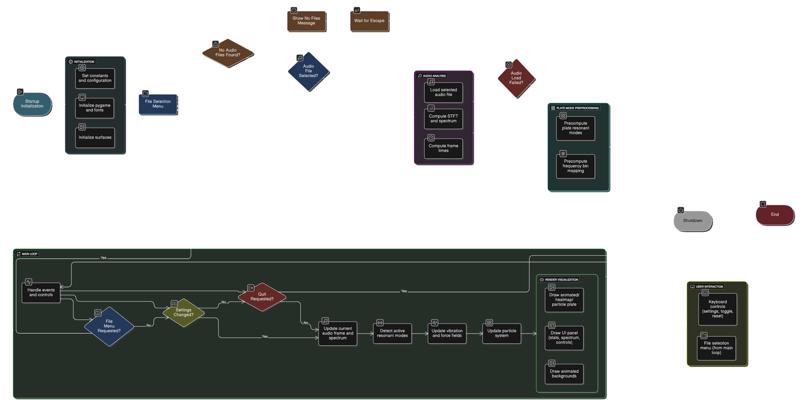

# **Chladni Resonance Visualizer**

This project is an interactive, real-time physics simulation that visualizes **Chladni figures** by analyzing audio files. It simulates thousands of sand-like particles on a vibrating plate, where their movement is driven by the frequency components of the input audio. The particles dynamically arrange themselves into the beautiful, intricate patterns seen at the plate's nodal lines (areas of minimal vibration), creating a mesmerizing and artistic representation of sound.

The application is built with Pygame and features a polished, "glassmorphism" style user interface, a file selection menu, and a dashboard that displays real-time statistics about the simulation and audio analysis.

## **Features**

* **Real-time Audio Analysis**: Utilizes the librosa library to perform a Short-Time Fourier Transform (STFT) on any standard audio file (.mp3, .wav, .flac, etc.).  
* **High-Performance Physics**: A fully vectorized particle simulation using NumPy to efficiently handle tens of thousands of particles. The model includes forces, friction, Brownian motion, and boundary collisions.  
* **Accurate Resonance Modes**: Pre-computes the theoretical resonant frequencies and their corresponding mathematical patterns for different plate shapes (square and circle).  
* **Interactive Controls**: Allows for real-time adjustment of frequency sensitivity, visualization modes, plate shape, and other simulation parameters.  
* **Elegant User Interface**: A modern UI with glassmorphic panels, animated backgrounds, and clear data readouts for FPS, active particle count, and dominant resonant modes.  
* **Multiple Visualization Modes**:  
  * **Sand Mode**: Renders individual particles for a realistic "sand on a plate" look.  
  * **Heatmap Mode**: Visualizes the intensity of the vibration field across the entire plate.  
  * **Node Overlay**: An optional visual aid to highlight the nodal lines where particles gather.  
* **Efficient Particle Management**: Includes an automatic system to recycle particles that get stuck at the boundaries, ensuring a continuous and dynamic simulation.

## **How It Works**

The simulation follows a clear pipeline from audio input to visual output:

1. **Audio Processing**: The selected audio file is loaded, and its spectrogram is calculated. This breaks the audio into short time windows and determines the intensity of different frequencies within each window.  
2. **Mode Matching**: The application has a pre-computed list of the plate's natural resonant frequencies (e.g., modes like (1,2), (2,1), (3,4) for a square plate). In each audio frame, it checks the spectrogram to see which of these resonant frequencies are active.  
3. **Vibration Field Generation**: For each active resonant frequency, its corresponding mathematical pattern (a combination of sine waves) is retrieved. All active patterns are summed together, weighted by their intensity in the audio, to create a final "vibration field" for that instant.  
4. **Force Calculation**: The simulation computes the gradient of the vibration field. This creates two primary forces on the particles:  
   * A **repulsive force** pushing them away from areas of high vibration (anti-nodes).  
   * An **attractive force** pulling them towards areas of zero vibration (nodes).  
5. **Particle Update**: Each particle's velocity is updated based on the forces at its location. Its position is then updated based on its new velocity. Friction, drag, and a small random motion (Brownian) are also applied.  
6. **Rendering**: All particles are drawn to the screen using Pygame, and the UI is overlaid. This loop repeats up to 60 times per second to create a smooth, real-time animation.
7. 

## **Getting Started**

Follow these instructions to get the project running on your local machine.

### **Prerequisites**

You need to have Python 3 installed. The project relies on several external libraries that can be installed via pip.

* pygame: For graphics, windowing, and audio playback.  
* librosa: For advanced audio analysis.  
* numpy: For high-performance numerical operations.  
* scipy: Used for filtering the calculated force fields.  
* matplotlib: Used for its color maps in the heatmap visualization.

### **Installation**

1. **Clone the repository (or download the main.py script)**:  
   git clone <https://github.com/mutasim-rehman/Chladni-patterns>
   cd chladni-resonance-visualizer

2. **Install the required libraries**:  
   pip install pygame librosa numpy scipy matplotlib

   *Note: librosa requires an audio decoding backend like ffmpeg. If you encounter errors loading non-WAV audio files, you may need to install it on your system.*  
3. **Create the audio directory**: The program looks for audio files in a directory named pieces. Create this folder in the same directory as the main.py script.  
   mkdir pieces

4. **Add your audio files**: Place any .mp3, .wav, .flac, or .ogg files you want to visualize inside the pieces directory.

## **Usage**

### **Running the Application**

To start the visualizer, run the main script from your terminal:

python main.py

This will open the file selection menu. Use the UP and DOWN arrow keys to choose a file and press ENTER to begin the simulation.

### **Controls**

The simulation can be controlled with the following keys during playback:

| Key | Action |
| :---- | :---- |
| **ESC** | Quit the application. |
| **SPACE** | Reset the particle simulation to its initial state. |
| **F** | Return to the file selection menu. |
| **\- / \+** | Decrease / Increase the frequency detection sensitivity. |
| **C** | Toggle between **Sand** and **Heatmap** view modes. |
| **R** | Toggle the plate shape between **Square** and **Circle**. |
| **N** | Toggle the visibility of the blue **Node** overlay. |
| **S** | Toggle the particle **Spawning/Recycling** system on/off. |

